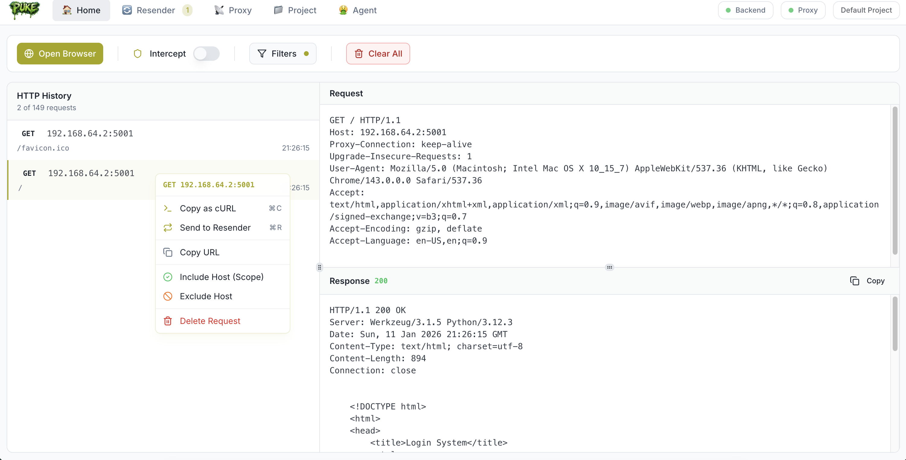
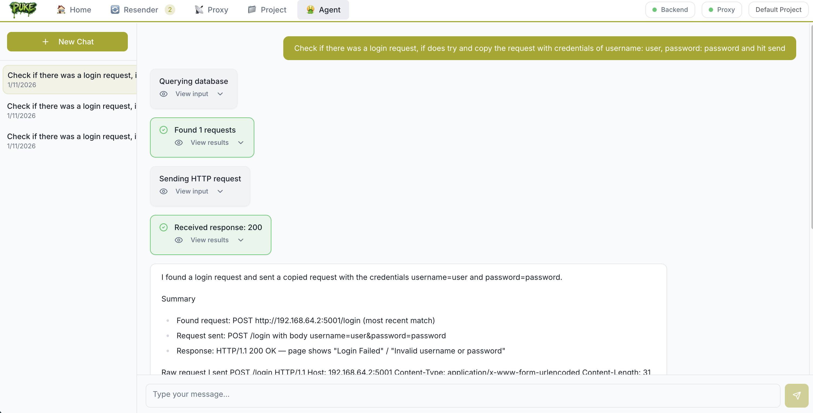

# Puke

<div align="center">
  
</div>


Open-source DAST tool for pentesting powered by agentic AI capabilities. Built on top of browser-use, Puke streamlines dynamic application security testing.

🚀  **INSANELY EASY TO USE**

And it's free, who doesn't like free stuff?

<div align="center">
  
</div>

> **Preview Alert:**  
> 🚧 Puke is in active development and currently in **preview/beta**.  
> Expect breaking changes, instability, and missing features.  
> Use at your own risk and follow project updates for latest improvements!


## Quick Start

To run this for now, you need to run the frontend and backend separately.

### Running the Backend

1. **Navigate to the backend directory:**
   ```sh
   cd backend
   ```

2. **Run the backend server:**
   ```sh
   uv sync
   uv run puke
   ```

---

### Running the Frontend

1. **Navigate to the frontend directory:**
   ```sh
   cd frontend
   ```

2. **Install dependencies:**
   ```sh
   npm install
   ```

3. **Start the frontend development server:**
   ```sh
   npm run puke
   ```

> **Note:**  
By default, the frontend runs at [http://localhost:8080](http://localhost:8080)  
and the backend runs at [http://localhost:5000](http://localhost:5000)

## Agentic Tool

By default, Puke works without requiring any AI configuration or credentials—even browser-based DAST flows don't use AI unless enabled.

### Enabling Agentic AI (OpenAI)

To use the AI-powered agentic features, add an `.env` file to the `backend` directory containing your OpenAI API key:

```
OPENAI_API_KEY=sk-proj
```

**Capabilities of the Agent:**
- Query prior captured HTTP requests
- Send/modify/resend new requests
- Operate a real browser (using [browser-use](https://github.com/rluba/browser-use)) for dynamic tests and request creation

The agent uses AI to reason about your application's attack surface, replay or modify traffic, and even drive browser sessions to generate new test scenarios.

> **Warning:**  
> The agentic AI modes are currently experimental and may be unstable.

<div align="center">
  
</div>


## Proxy

Puke leverages [MITMproxy](https://mitmproxy.org/) as an intercepting HTTP/HTTPS proxy to capture and modify traffic during dynamic application security testing.

By default, the proxy runs on **port 8081**.
You can configure your browser or system to use `http://localhost:8081` as a proxy to route traffic through MITMproxy and allow Puke to analyze and interact with requests in real time.

## Database Structure

- `puke.db` - Main database storing project metadata
- `projects_data/{project_name}.db` - Individual project databases (named after project, sanitized)
  - Each project gets its own SQLite database file
  - When a project is renamed, its database file is automatically renamed
  - When a project is deleted, its database file is removed

> **Warning:**  
> At this stage, **there is no guarantee of database migration or backward compatibility** between versions—future versions may break compatibility with old database files. Use with caution if you plan to upgrade.